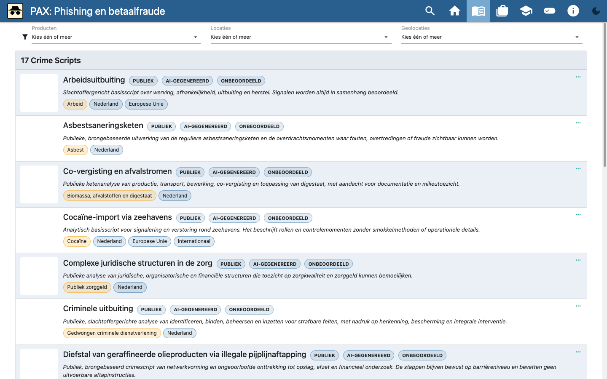
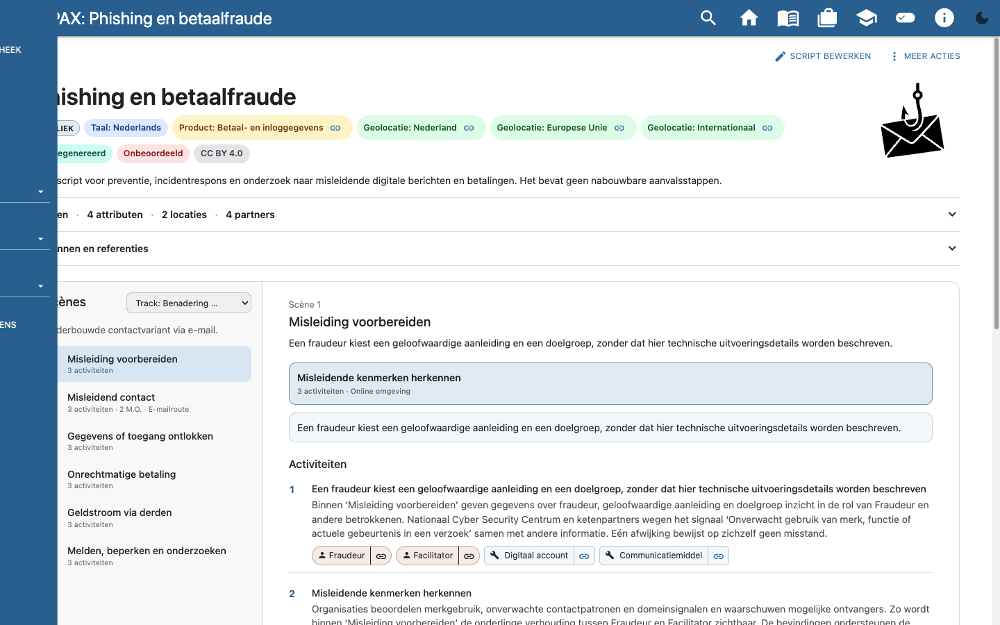
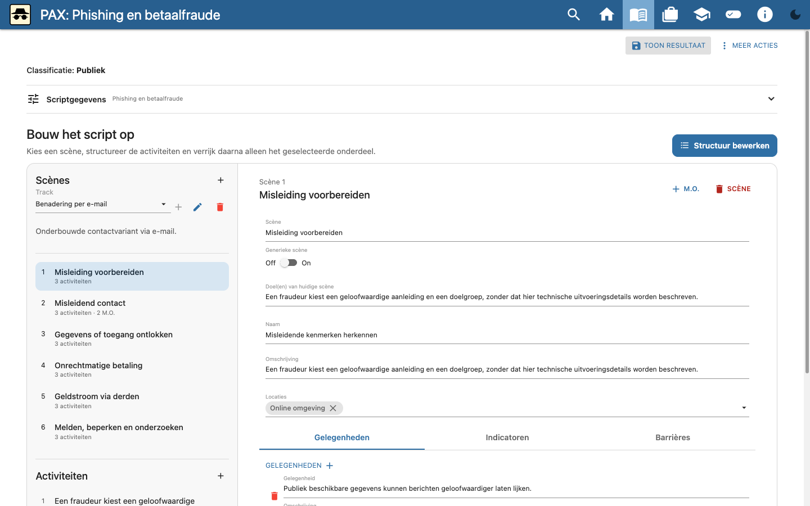

# PAX Crime Scripting

PAX is a browser-based workspace for viewing, editing, and comparing crime
scripts. Start with the public example library, or import your own JSON model.
The starter scripts are **AI-generated and unreviewed**: use them for
exploration and training, not as established findings.

[Open PAX](https://tno.github.io/crime_scripts/) ·
[Nederlandse handleiding met video](https://tno.github.io/crime_scripts/#!/handleiding?lang=nl) ·
[English user guide with video](https://tno.github.io/crime_scripts/#!/guide?lang=en)

## Explore the starter kit

Choose **Use starter library** on first launch. The public library provides 17
example scripts in Dutch or English (selected by the interface language).
Browse and filter scripts by product or location; a card opens the script
viewer. The images below show public Dutch starter data.



The viewer shows the script's scenes and alternative modi operandi, activities,
related roles and taxonomy, evidence indicators, and sources. Select a scene or
track to explore a different route; the link icons on taxonomy items show
where they are used.



Select **Editor** or **Administrator** in the workspace menu to edit a script.
The editor separates scene structure from the details of the selected scene.
Use **More actions** to export a script as JSON or Word, share a *public*
script link, or export its barrier model.



The **Case file** compares observed facts with available scripts; **Learning
mode** lets you practise reconstructing one and compare your choices with a
reference. Administrators can use the provider-neutral **Generate with LLM**
wizard to create a prompt, paste JSON from an external LLM, and review it
before explicitly importing. PAX does not itself contact an LLM or retrieve
source URLs.

The workspace is stored locally in your browser. Export its JSON before
clearing browser data or replacing it with an imported model. The role and
public/restricted mode selectors are **not access controls**; never publish
restricted case material or include it in public screenshots or links.

## Development

This TypeScript monorepo uses pnpm. With Node.js and pnpm installed:

```sh
pnpm install
pnpm --dir packages/gui dev
```

Open the local URL printed by Vite. To build the GUI:

```sh
pnpm --dir packages/gui build
```

Pushing to `main` runs `.github/workflows/gui-pages.yml` to build and deploy
the GUI to GitHub Pages. The tracked `docs/` directory is a legacy snapshot,
not the deployment source.

## Documentation

- [Nederlandse gebruikershandleiding](documentation/handleiding.nl.md) and
  [English user guide](documentation/user-guide.en.md) (both include screenshots
  and a short walkthrough video).
- [Media capture and video reproduction](documentation/media-productie.md).
- [Restricted Witwassen CLI workflow (Dutch)](documentation/restricted-witwassen-cli.nl.md)
  and its [short video](documentation/assets/restricted-cli/restricted-witwassen-cli.webm).
- [Crime Script Generator CLI](packages/script-generator/README.md).
- [Task index](TASKS/README.md).
