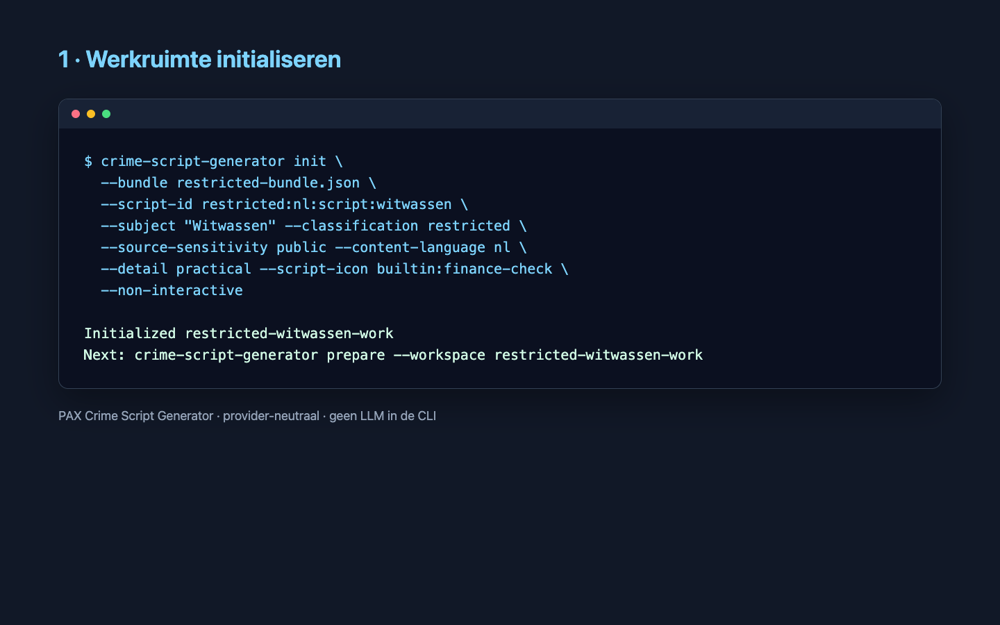
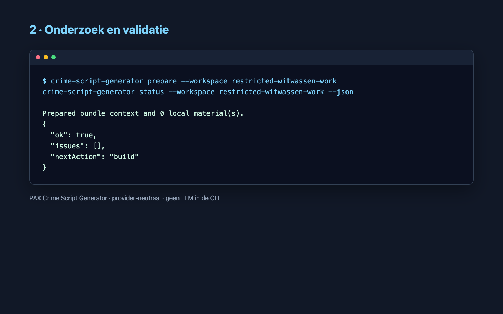
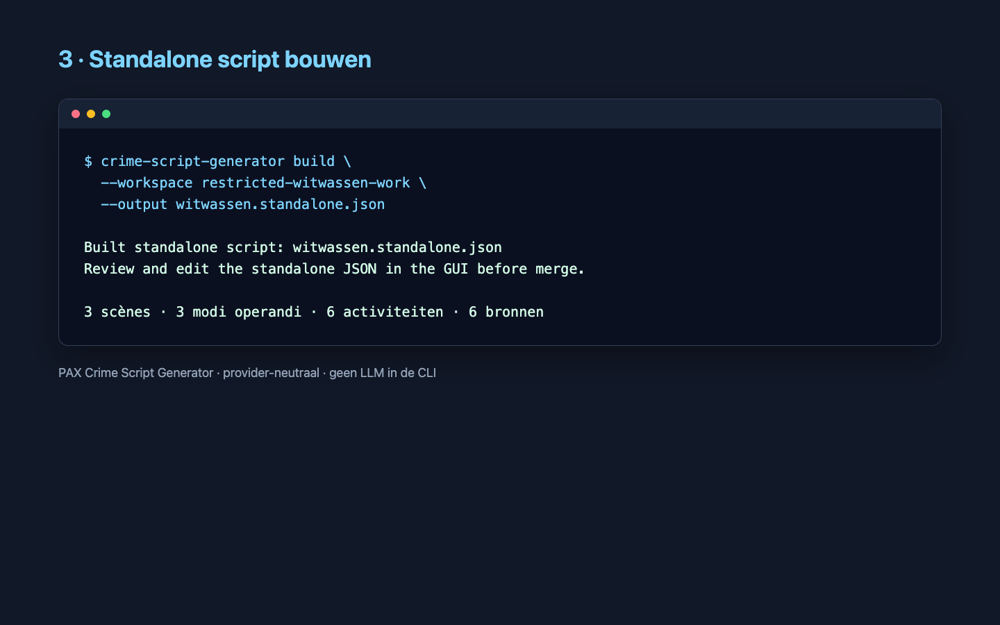
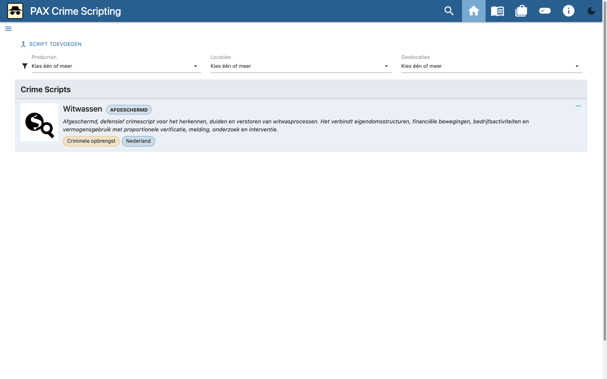
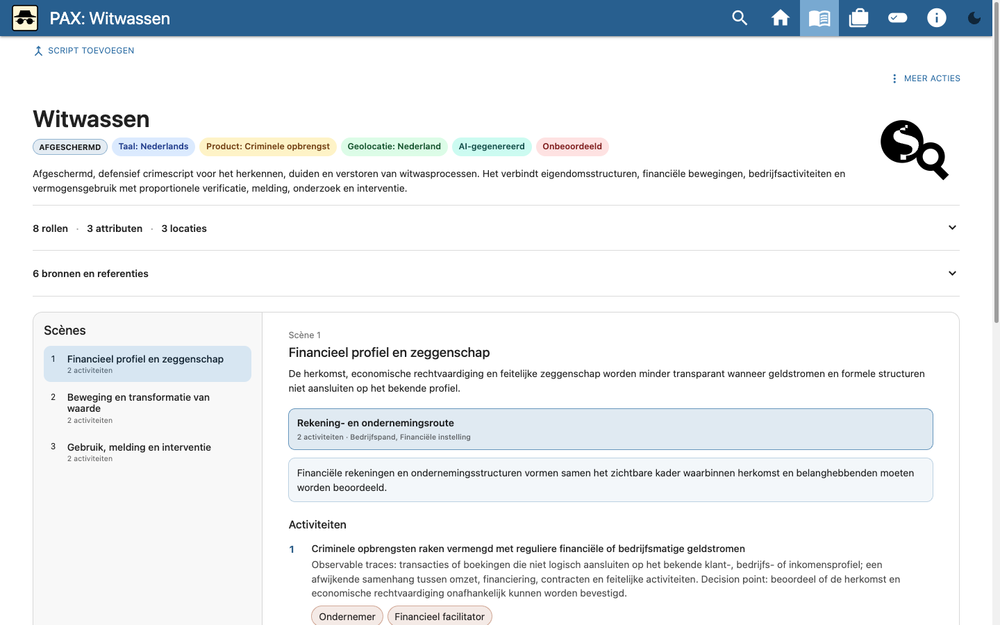

# Afgeschermd script “Witwassen” maken met de CLI

Deze walkthrough laat zien hoe het provider-neutrale
`crime-script-generator`-proces is gebruikt om een afgeschermd Nederlands
script over witwassen te maken. De CLI bevat geen LLM. Onderzoek en redactie
zijn buiten de CLI uitgevoerd; de CLI bewaakt structuur, bewijsdekking,
veiligheid en de review-/mergegrens.

[Bekijk de korte walkthrough (WebM, 336 kB)](assets/restricted-cli/restricted-witwassen-cli.webm)

De afbeeldingen tonen gesaniteerde commando's. Lokale absolute paden en het
afgeschermde bundelbestand staan niet in deze repository.

## 1. Geïsoleerde werkruimte initialiseren

De bronbundel blijft ongewijzigd. De opdracht legt classificatie, taal,
doelgroep, detailniveau en een bestaand catalogusicoon expliciet vast.

```sh
crime-script-generator init \
  --bundle restricted-bundle.json \
  --workspace restricted-witwassen-work \
  --script-id restricted:nl:script:witwassen \
  --subject "Witwassen" \
  --purpose "Defensieve analyse van witwasprocessen, signalen en interventiemomenten voor Nederlandse RIEC-partners" \
  --geography "Nederland" \
  --content-language nl \
  --classification restricted \
  --source-sensitivity public \
  --detail practical \
  --script-icon builtin:finance-check \
  --non-interactive
```



## 2. Voorbereiden, onderzoeken en valideren

Na `prepare` zijn uitsluitend generieke openbare begrippen gebruikt voor
onderzoek. Geaccepteerde bronnen omvatten de Wwft, FIU-Nederland, het Openbaar
Ministerie, KVK en de Autoriteit Persoonsgegevens. Een aparte
beperkingenzoektocht behandelde niet-uitputtende typologieën en foutpositieven;
een ontbrekend-perspectiefzoektocht behandelde privacy en proportionaliteit.

`candidate.json`, `evidence.json` en `research-log.json` zijn gezamenlijk
gevalideerd:

```sh
crime-script-generator prepare --workspace restricted-witwassen-work
crime-script-generator status --workspace restricted-witwassen-work --json
```

De laatste status bevatte geen issues en gaf `nextAction: "build"`.



## 3. Standalone reviewbestand bouwen

```sh
crime-script-generator build \
  --workspace restricted-witwassen-work \
  --output witwassen.standalone.json
```

Het resultaat bevat:

- één afgeschermd script met ID `restricted:nl:script:witwassen`;
- drie scènes en drie modi operandi;
- zes activiteiten;
- indicatoren met corroboratie en legitieme alternatieve verklaringen;
- proportionele barrières met verantwoordelijke partners;
- zes openbare bronnen;
- de verplichte statussen **AI-gegenereerd**, **Onbeoordeeld** en
  **Eerste concept**.

Het script bevat geen stappenplan, exploiteerbare parameters of
ontwijkingstactieken.



## 4. In de GUI controleren

Het standalone bestand is in een geïsoleerde browserwerkruimte geladen. De
startpagina toonde het script als **Afgeschermd**.



De viewercontrole bevestigde titel, classificatie, taal, product, geografie,
herkomststatus, drie scènes, rollen, attributen, locaties en zes bronnen.
Activiteiten, indicatoren en barrières werden zonder consolefouten of
horizontale overflow weergegeven.



## 5. Bewaakt samenvoegen

Na de expliciete opdracht om het script aan de afgeschermde bundel toe te
voegen, is de gereviewde standalone-uitvoer samengevoegd:

```sh
crime-script-generator merge \
  --workspace restricted-witwassen-work \
  --standalone witwassen.standalone.json \
  --bundle restricted-bundle.json \
  --yes
```

De CLI schreef een nieuw bestand en wijzigde de bronbundel niet. De lokale
uitvoer bevat 18 scripts, waaronder precies één
`restricted:nl:script:witwassen`, en geen dubbele IDs.

## Lokale artefacten

De afgeschermde uitvoer blijft buiten Git:

- werkruimte:
  `files/restricted-witwassen-work-20260925/`;
- standalone SHA-256:
  `71d1a49cf43cbce1b8bef72f79d0b291996989ffd4e7b331f8ca6505bf8aca14`;
- samengevoegde bundel:
  `files/restricted-bundle-witwassen.json`;
- bundel SHA-256:
  `76ccb58ce1806000cd2c048256d35eae2b9f317270e27eff1b83cec0c0a9174a`.

`files/` verwijst hier naar de afgeschermde bestandruimte van de lokale
Copilot-sessie, niet naar een repositorypad. Deel deze bestanden alleen via
een passend beveiligd kanaal.
